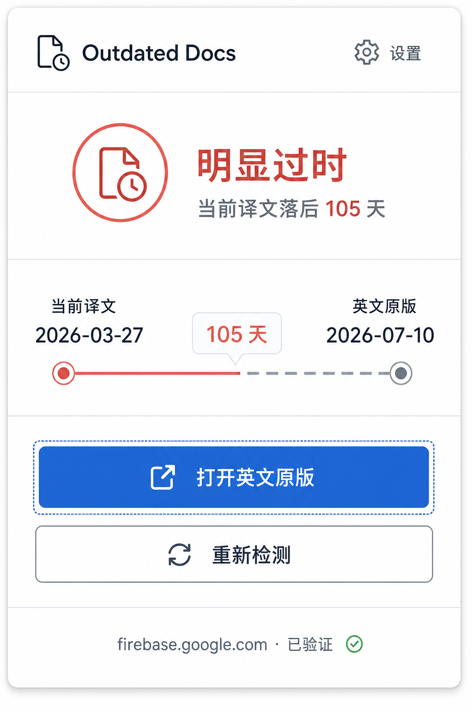

# Outdated Docs

Outdated Docs is a bilingual Chrome extension that compares the published date of a localized developer document with its English original. It reports timestamp lag without claiming that the page content is necessarily different.

Outdated Docs 是一款默认支持中英双语的 Chrome 扩展。它对比开发者文档译文与英文原版的更新时间，只报告时间差，不推断内容或翻译质量。



## Supported documentation

- MDN Web Docs
- Android Developers
- Google for Developers
- Firebase
- TensorFlow
- Android Open Source Project
- Google Cloud, including `cloud.google.com` and `docs.cloud.google.com`

MDN and Google DevSite markup are isolated behind separate adapters in `lib/analyzers`. A missing English link, missing date, invalid date, or failed request produces an “Unable to determine” or retryable error state; it never produces a stale warning.

## Freshness states

- Up to 30 minutes behind: up to date
- More than 30 minutes but less than 45 days behind: slightly behind
- At least 45 days behind: clearly outdated
- A localized page newer than English: up to date
- Unreliable input or network failure: unable to determine

## Architecture

The content script selects a site adapter and parses the current DOM. The Manifest V3 service worker fetches only the detected HTTPS English URL, validates both the requested and final host against the configured adapter list, and returns HTML plus `Last-Modified`. The content script parses the English response and publishes a serializable result used by the toolbar icon, Popup, and isolated Shadow DOM notice.

The only synchronized setting is `showPageNotice`, which defaults to `true`. Per-tab analysis results use `chrome.storage.session`, are bound to the exact document URL, and are cleared on navigation or when the tab closes.

## Development

Requirements:

- Node.js 20.12 or newer
- npm
- Chrome or Playwright Chromium for extension testing

```sh
npm install
npm run dev
```

Build and load `.output/chrome-mv3` from `chrome://extensions` using “Load unpacked”. Press `Alt+Shift+E` to open the Popup.

Run the full local gate:

```sh
npm run lint
npm run typecheck
npm test
npm run build
npm run test:e2e
npm run zip
```

Playwright launches the complete WXT/Chromium parent process with a persistent context so the MV3 service worker, Popup, Options page, content script, and Shadow Root run as a real extension. Use `npm run test:e2e:update` only when intentionally accepting visual changes.

## Permissions and privacy

The extension requests `storage` and host access only for the documentation sites listed above. It contains no analytics, account system, remote code, backend, or telemetry. See [PRIVACY.md](PRIVACY.md).

## Scope

This first release targets Chrome Manifest V3. It does not perform semantic comparison, translation-quality scoring, custom user-defined site rules, cloud sync, or cross-browser store packaging.

The public license and Chrome Web Store publisher details remain release-stage decisions.
