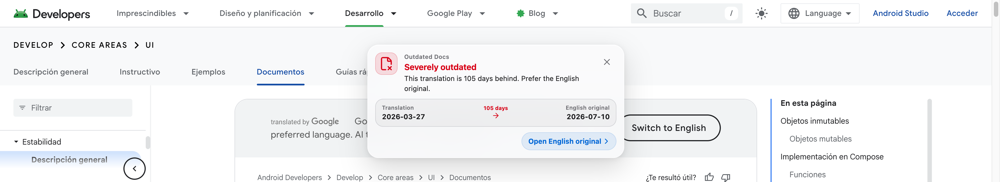
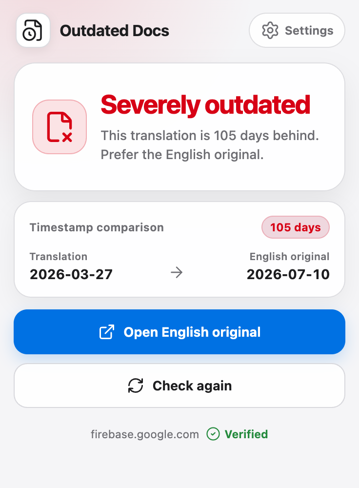

# Outdated Docs

[](https://github.com/zhaobozhen/Outdated-Doc-Detector/actions/workflows/ci.yml)
[](https://github.com/zhaobozhen/Outdated-Doc-Detector/actions/workflows/nightly-release.yml)

Outdated Docs is a bilingual Chrome extension that compares the last-updated
date of a localized developer document with its English original. It reports
timestamp lag without claiming that the page content is necessarily different.

## Preview

<p align="center">
  <picture>
    <source media="(prefers-color-scheme: dark)" srcset="docs/screenshots/in-page-notice-dark.webp">
    <source media="(prefers-color-scheme: light)" srcset="docs/screenshots/in-page-notice-light.webp">
    
  </picture>
</p>
<p align="center">
  <sub><strong>In-page notice</strong> — See the lag and both document dates without leaving the page.</sub>
</p>

<br>

<p align="center">
  <picture>
    <source media="(prefers-color-scheme: dark)" srcset="docs/screenshots/popup-dark.webp">
    <source media="(prefers-color-scheme: light)" srcset="docs/screenshots/popup-light.webp">
    
  </picture>
</p>
<p align="center">
  <sub><strong>Extension popup</strong> — Compare timestamps, open English, or run the check again.</sub>
</p>

## Origin And Acknowledgements

This project is an independently maintained modern implementation inspired by
[hanguokai/Outdated-Doc-Detector](https://github.com/hanguokai/Outdated-Doc-Detector),
which established the original product idea and use case. This repository is
not an official continuation published by the original project's author.

## Product Shape

- The content script reads the current document and renders an optional,
  isolated in-page notice.
- The Manifest V3 service worker fetches the declared English original across
  origins and owns per-tab result state and toolbar status.
- The Popup shows the comparison, opens the English original, and can trigger a
  new check.
- The Options page controls whether the in-page notice is shown.
- The first release targets Chrome Manifest V3. It has no account, backend,
  analytics, telemetry, or remotely hosted executable code.

See [AGENTS.md](AGENTS.md) for coding-agent guidance, module boundaries, and
validation rules.

## Supported Documentation

| Documentation | Hosts | Adapter |
| --- | --- | --- |
| MDN Web Docs | `developer.mozilla.org` | `MdnAdapter` |
| Android Developers | `developer.android.com` | `GoogleDevsiteAdapter` |
| Google for Developers | `developers.google.com` | `GoogleDevsiteAdapter` |
| Firebase | `firebase.google.com` | `GoogleDevsiteAdapter` |
| TensorFlow | `www.tensorflow.org` | `GoogleDevsiteAdapter` |
| Android Open Source Project | `source.android.com` | `GoogleDevsiteAdapter` |
| Google Cloud | `cloud.google.com`, `docs.cloud.google.com` | `GoogleDevsiteAdapter` |

MDN and Google DevSite markup are isolated behind separate adapters in
`lib/analyzers/`. A missing English link, missing date, invalid date, or failed
request produces an unable-to-determine or retryable error state. It never
produces an outdated warning from unreliable input.

## Freshness States

| Comparison | Result |
| --- | --- |
| Translation is no more than 30 minutes behind | Up to date |
| Translation is over 30 minutes but under 7 days behind | Slightly behind |
| Translation is at least 7 days but under 45 days behind | Noticeably behind |
| Translation is at least 45 days behind | Severely outdated |
| Translation is newer than the English original | Up to date |
| Date, English link, or network response is unreliable | Unable to determine |

## Architecture

```text
Current document DOM
  -> content script
  -> site adapter
  -> localized page metadata

English original URL
  -> Manifest V3 service worker
  -> validated HTTPS request
  -> content script parses returned HTML
  -> normalized analysis result
     -> toolbar icon
     -> Popup
     -> Shadow DOM page notice

Options
  -> chrome.storage.sync
  -> showPageNotice
```

The service worker validates the requested URL against the originating adapter
family before returning HTML and `Last-Modified`. Requests include site cookies
but reject redirects so credentials cannot move to another origin. The content
script remains responsible for parsing both documents, so site-specific
selectors stay inside the adapter layer.

The only synchronized setting is `showPageNotice`, which defaults to `true`.
Per-tab results use `chrome.storage.session`, are bound to the exact document
URL, and are cleared on navigation or when the tab closes.

## Quick Start

Requirements:

- Node.js 20.12 or newer
- npm and the committed lockfile
- Chrome or Playwright Chromium for extension testing

Install dependencies and start WXT development mode:

```sh
npm install
npm run dev
```

For a production build, run:

```sh
npm run build
```

Then open `chrome://extensions`, enable Developer mode, choose **Load unpacked**,
and select `.output/chrome-mv3`. Press `Alt+Shift+E` to open the Popup.

## Scripts

| Command | Purpose |
| --- | --- |
| `npm run dev` | Start WXT development mode. |
| `npm run lint` | Run Oxlint with warnings denied. |
| `npm run typecheck` | Run TypeScript without emitting files. |
| `npm test` | Run Vitest unit and fixture tests once. |
| `npm run test:watch` | Run Vitest in watch mode. |
| `npm run build` | Build the production Chrome MV3 extension. |
| `npm run test:e2e` | Build in test mode and run the real MV3 Playwright suite. |
| `npm run test:e2e:update` | Intentionally replace all accepted visual snapshots. |
| `npm run zip` | Build and create the Chrome Web Store ZIP under `.output/`. |

Run the complete release gate from the repository root:

```sh
npm run lint
npm run typecheck
npm test
npm run build
npm run test:e2e
npm run zip
```

Playwright launches a persistent Chromium context with the built extension. The
suite exercises the MV3 service worker, Popup, Options page, content script,
Shadow Root, keyboard focus, SPA navigation, narrow layout, and light and dark
themes. Use `npm run test:e2e:update` only after visually reviewing an intended
UI change, then run `npm run test:e2e` again against the new baseline.

## Continuous Integration And Nightly Releases

[CI](.github/workflows/ci.yml) runs the complete validation gate on pushes to
`main`, pull requests, and manual dispatches. The workflow uses a macOS runner
because the accepted Playwright visual baselines are platform-specific.

[Nightly Release](.github/workflows/nightly-release.yml) runs every day at
00:17 Asia/Shanghai and can also be started manually from the Actions tab on
the default branch. After the same validation gate passes, it updates the
fixed [`nightly` prerelease](https://github.com/zhaobozhen/Outdated-Doc-Detector/releases/tag/nightly)
with:

- `outdated-docs-nightly-chrome.zip`
- `outdated-docs-nightly-chrome.zip.sha256`

Nightly builds are unsigned development packages and are never marked as the
latest stable release. Unzip the package, open `chrome://extensions`, enable
Developer mode, and load the unpacked directory.

## Localization

Chrome locale catalogs live in `public/_locales/`:

- `public/_locales/en/messages.json` is the default catalog.
- `public/_locales/zh_CN/messages.json` is the Simplified Chinese catalog.
- `lib/i18n.ts` owns the typed message-key boundary and date formatting.

Keep keys aligned across both catalogs and preserve placeholders such as `$1`.
After adding or renaming locale keys, run `npm run prepare`, then typecheck and
test the affected UI.

## Permissions And Privacy

The production manifest requests only:

- `storage`, for the page-notice preference and per-tab session results.
- Host access for the documentation domains listed above.

The extension does not request a broad browsing-history permission. It fetches
only a supported page's declared English original. See [PRIVACY.md](PRIVACY.md)
for the user-facing privacy statement.

## Project Layout

```text
entrypoints/
  background.ts             MV3 service worker, fetch proxy, result state
  detector.content/         Adapter orchestration and Shadow DOM notice
  popup/                    Toolbar Popup React entrypoint
  options/                  Settings React entrypoint
lib/
  analyzers/                Site registry, adapters, and DOM parsers
  analysis/                 Result model, comparison rules, and cache guard
  storage/                  Synced settings access
components/                 Shared Lucide icon mapping, notice UI, and CSS tokens
public/_locales/             Chrome i18n catalogs
public/icons/                Toolbar and store icon assets
tests/fixtures/              Stable documentation DOM fixtures
e2e/                        MV3 Playwright tests and visual baselines
docs/design/                Generated design references
```

## Scope

This release does not perform semantic comparison, translation-quality scoring,
custom user-defined site rules, cloud sync, or cross-browser store packaging.
If a documentation site stops exposing a reliable comparable date, that site
must return unable to determine instead of falling back to response time or a
guessed value.

The public license and Chrome Web Store publisher details remain release-stage
decisions.
